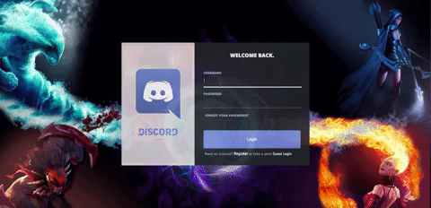

# This-Chord

[Live link][heroku]

[heroku]: http://this-chord.herokuapp.com

This-Chord is a single page web application inspired by Discord, the free voice and text chat app designed with gamers in mind. This-Chord's backend is built on Ruby on Rails and frontend on React/Redux with the following functionalities:

  * Real-time chat functionality utilizing Pusher's API bidirectional TCP connection
  * Self-implemented authorization leveraging BCrypt to hash passwords and Base64 to generate session token
  * Creation of deletion of public channels open for anybody and everybody to join and talk to one another. Direct messages can also be made to ensure some conversations are kept private.

## Features

### User Authentication

