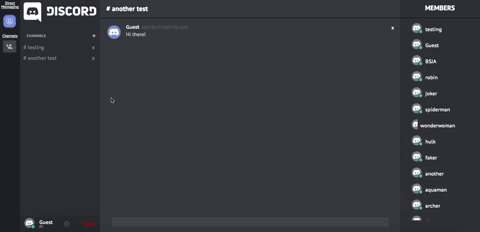
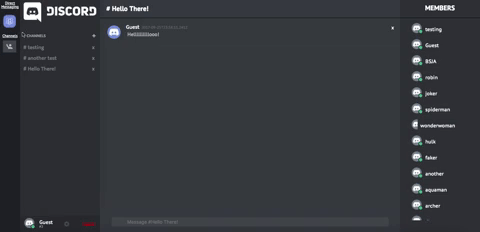

# This-Chord

[Live link][heroku]

[heroku]: http://this-chord.herokuapp.com

This-Chord is a single page web application inspired by Discord, the free voice and text chat app designed with gamers in mind. This-Chord's backend is built on Ruby on Rails and frontend on React/Redux with the following functionalities:

  * Real-time chat functionality utilizing Pusher's API bidirectional TCP connection
  * Self-implemented authorization leveraging BCrypt to hash passwords and Base64 to generate session token
  * Creation of deletion of public channels open for anybody and everybody to join and talk to one another. Direct messages can also be made to ensure some conversations are kept private.

## Features

### User Authentication

On first entering This-Chord, you will be prompted to either Login, Create a New Account, or sign in as Guest. The authentication utilizes a Protected Route that ensures users who attempt to access the inners of This-Chord are re-routed to the Login page.

On creation of an account, the user's password is sent to the backend, hashed using the BCrypt gem, and saved as a password digest. On login, their attempted password is hashed and checked against the saved password digest.

### Channel Creation

Creating a channel is simple! Simply click the white + and you will be prompted to create a channel of your choosing.

### Direct Messages Creation

Creating a direct message is just as easy! You can navigate to the direct messages via the blue top left icon. Then similar to creating a channel, click the white +. Simply choose the users you would like to start a direct message with.  
